# SpringSecurityStudy
SpringSecurity学习。

跟练，跟学，这要是测试各种功能和模块。

## 1.创建项目如下

> 也就是和之前SpringMVCDemo一样的架构，这里就不在赘述了。

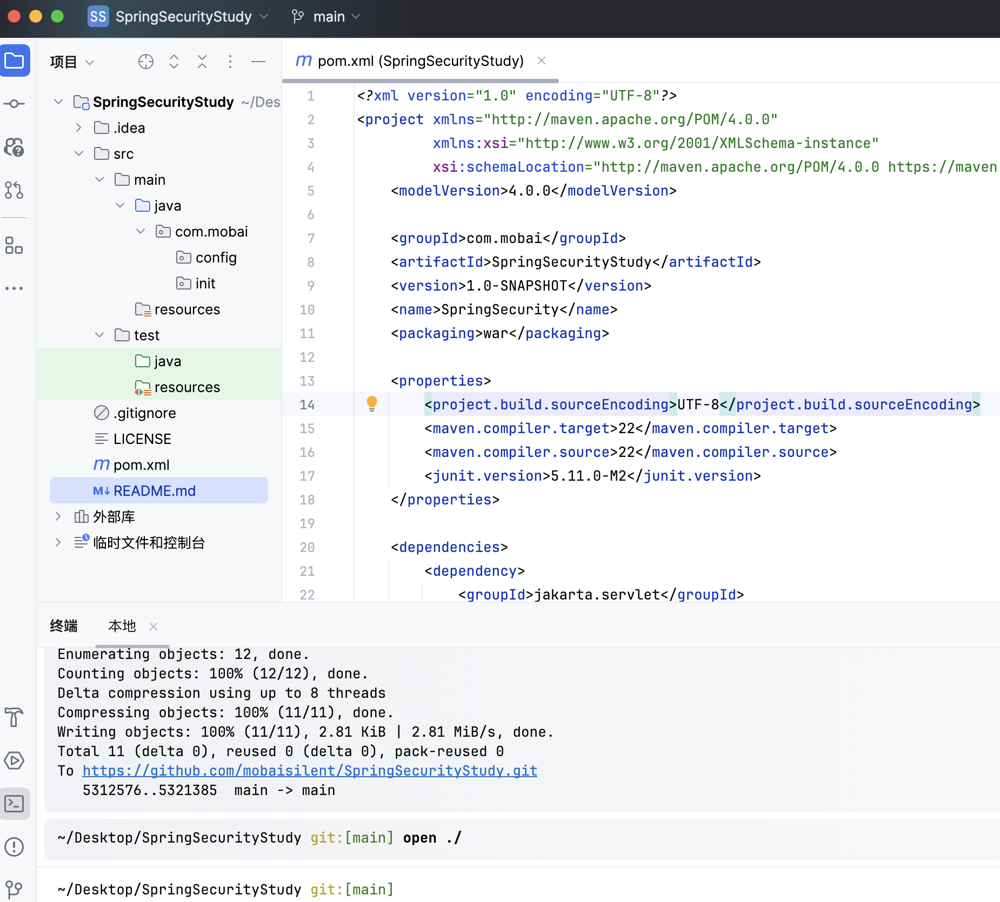

插件的依赖如下：

- spirng-webmvc
- thymeleaf
- fastjson2
- fastjson2-extension-spring6
- slf4j-api
- slf4j-jdk14
- lombok

> 不代表所有，注意后续添加，这里可以注意下，maven添加的依赖其实大多是有顺序的，有时候会因为顺序问题发生奇奇怪怪的错误。这里提醒一下。

> 这里在提示一下，idea有时候项目名称旁边会有一个中括号，里面和自己项目的名称不一样，其实是模块名和文件夹名冲突了而已。对应修改下组件名称即可。

## 2.初始两件套

> config和init顾名思义，里面放置WebConfiguration和MainInitializer

WebConfiguration.java

```java
package com.mobai.config;

import org.springframework.context.annotation.Bean;
import org.springframework.context.annotation.Configuration;
import org.springframework.web.servlet.config.annotation.EnableWebMvc;
import org.springframework.web.servlet.config.annotation.WebMvcConfigurer;
import org.thymeleaf.spring6.SpringTemplateEngine;
import org.thymeleaf.spring6.templateresolver.SpringResourceTemplateResolver;
import org.thymeleaf.spring6.view.ThymeleafViewResolver;
import org.thymeleaf.templateresolver.ITemplateResolver;

@Configuration
@EnableWebMvc
public class WebConfiguration implements WebMvcConfigurer {
  @Bean
  public ThymeleafViewResolver thymeleafViewResolver(SpringTemplateEngine springTemplateEngine) {
    ThymeleafViewResolver resolver = new ThymeleafViewResolver();
    resolver.setOrder(1);
    resolver.setCharacterEncoding("UTF-8");
    resolver.setTemplateEngine(springTemplateEngine);
    return resolver;
  }

  @Bean
  public SpringResourceTemplateResolver templateResolver() {
    SpringResourceTemplateResolver resolver = new SpringResourceTemplateResolver();
    resolver.setSuffix(".html");
    resolver.setPrefix("classpath:");
    return resolver;
  }

  @Bean
  public SpringTemplateEngine springTemplateEngine(ITemplateResolver resolver) {
    SpringTemplateEngine engine = new SpringTemplateEngine();
    engine.setTemplateResolver(resolver);
    return engine;
  }
}
```

> ThymeleafViewResolver -> SpringResourceTemplateResolver -> SpringTemplateEngine
>
> 尤其注意上面那个路径信息

MainInitializer.java

```java
package com.mobai.init;

import com.mobai.config.WebConfiguration;
import org.springframework.web.servlet.support.AbstractAnnotationConfigDispatcherServletInitializer;

public class MainInitializer extends AbstractAnnotationConfigDispatcherServletInitializer {

  @Override
  protected Class<?>[] getRootConfigClasses() {
    return new Class[]{WebConfiguration.class};
  }

  @Override
  protected Class<?>[] getServletConfigClasses() {
    return new Class[0];
  }

  @Override
  protected String[] getServletMappings() {
    return new String[]{"/"};
  }
}
```

> get -> RootConfig -> ServletConfig -> Servletmappings

注意这里路径和上面的路径都是/，而这次的html文件是放到resources文件夹目录下的，SpringMVCDemo是放在webapp文件夹下，都能运行是因为编译之后的结果就是直接放到根目录下。

## 3.添加信息

- HelloController
- login.html
- index.html

创建基础信息，这几个省略。见SpringSecurity文档。

HelloController.java

```java
package com.mobai.controller;

import jakarta.servlet.http.HttpSession;
import org.springframework.stereotype.Controller;
import org.springframework.ui.Model;
import org.springframework.web.bind.annotation.GetMapping;
import org.springframework.web.bind.annotation.PostMapping;
import org.springframework.web.bind.annotation.RequestParam;

@Controller
public class HelloController {
  //处理登录操作并跳转
  @PostMapping("/login")
  public String login(@RequestParam String username,
                      @RequestParam String password,
                      HttpSession session,
                      Model model){
    if("test".equals(username) && "123456".equals(password)) {
      session.setAttribute("login", true);
      return "redirect:/";
    } else {
      model.addAttribute("status", true);
      return "login";
    }
  }

  // 首页是：http://localhost:8080/mvc/,对应下面那个/请求
  
  //处理首页或是登录界面跳转
  @GetMapping("/")
  public String index(HttpSession session){
    if(session.getAttribute("login") != null) {
      return "index";
    }else {
      return "login";
    }
  }
}
```

> 这里很巧妙，注意看如何实现的。

运行项目，显然出错了，如下：

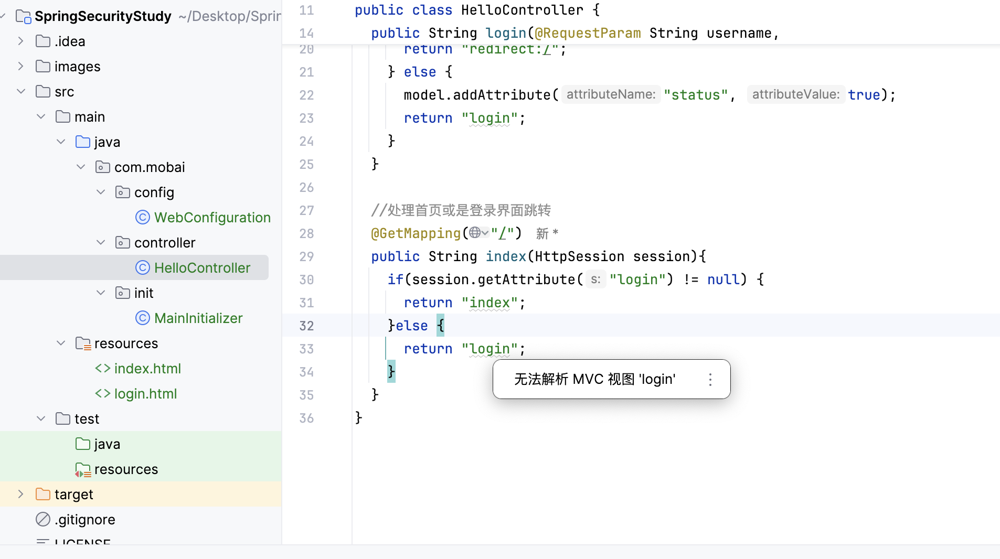

> 上次的SpringMVCDemo倒是把html放到webapp里面。

这里修改好上面的WebConfiguration.java即可，改为classpath:


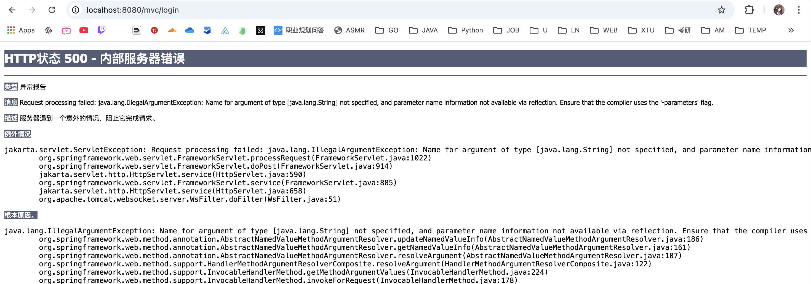

像下面遇见这种参数问题：

```xml
<build>
    <plugins>
        <plugin>
            <groupId>org.apache.maven.plugins</groupId>
            <artifactId>maven-compiler-plugin</artifactId>
            <version>3.8.1</version>
            <configuration>
                <compilerArgs>
                    <arg>-parameters</arg>
                </compilerArgs>
            </configuration>
        </plugin>
    </plugins>
</build>
```

然后clean重启服务器，不clean的话还是没用。

最后登录成功结果如下；

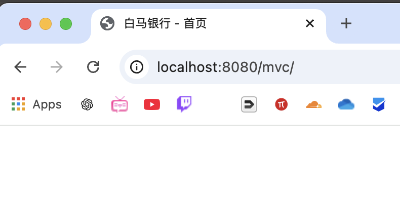

注意看HelloController是怎么写的。

主页和登录页修改如下；

index.html

```html
<!DOCTYPE html>
<html lang="en">
<head>
    <meta charset="UTF-8">
    <title>白马银行 - 首页</title>
    <script src="https://unpkg.com/axios@1.7.7/dist/axios.min.js"></script>
</head>
<body>
<div>
    <label>
        转账账号：
        <input type="text" id="account"/>
    </label>
    <button onclick="pay()">立即转账</button>
</div>
</body>
</html>

<script>
    function pay() {
        const account = document.getElementById("account").value
        axios.post('/mvc/pay', { account: account }, {
            headers: {
                'Content-Type': 'application/x-www-form-urlencoded',
                'Accept': 'application/json'  // 添加Accept头
            }
        }).then(({data}) => {
            console.log(data);
            if(data.success)
                alert("转账成功")
            else
                alert("转账失败")
        })
    }
</script>
```

login.html

```html
<!DOCTYPE html>
<html lang="en">
<head>
  <meta charset="UTF-8">
  <title>登录白马银行</title>
</head>
<body>
<form action="login" method="post">
  <label>
    用户名：
    <input name="username" type="text">
  </label>
  <label>
    密码：
    <input name="password" type="password">
  </label>
  <button type="submit">登录</button>
</form>
<div th:if="${status}">登录失败，用户名或密码错误！</div>
</body>
</html>
```

额，下面这里我一直犯406错误：

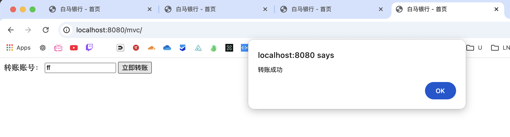

例如下面的HelloController，需要单独配置JSON解析器到WebConfiguration中去：

```java
package com.mobai.controller;

import com.alibaba.fastjson2.JSONObject;
import jakarta.servlet.http.HttpSession;
import org.springframework.stereotype.Controller;
import org.springframework.ui.Model;
import org.springframework.web.bind.annotation.*;

@Controller
public class HelloController {

  @ResponseBody
  @PostMapping("/pay")
  public JSONObject pay(@RequestParam String account,
                        HttpSession session){
    JSONObject object = new JSONObject();
    //登录之后才能转账
    if(session.getAttribute("login") != null) {
      System.out.println("转账给"+account+"成功，交易已完成！");
      object.put("success", true);
    } else {
      System.out.println("转账给"+account+"失败，用户未登录！");
      object.put("success", false);
    }
    System.out.println(object);
    return object;
  }

  //处理登录操作并跳转
  @PostMapping("/login")
  public String login(@RequestParam String username,
                      @RequestParam String password,
                      HttpSession session,
                      Model model) {
    if ("test".equals(username) && "123456".equals(password)) {
      session.setAttribute("login", true);
      return "redirect:/";
    } else {
      model.addAttribute("status", true);
      return "login";
    }
  }

  //处理首页或是登录界面跳转
  @GetMapping("/")
  public String index(HttpSession session) {
    if (session.getAttribute("login") != null) {
      return "index";
    } else {
      return "login";
    }
  }
}
```

有些东西，动手才能发现问题啊。

## 3.添加认证界面

具体省略，添加如下：

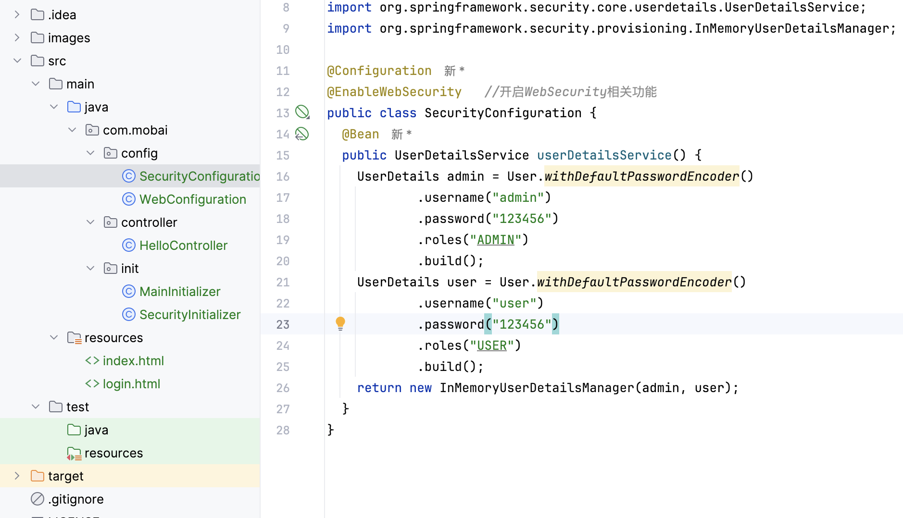

导入依赖：

- spring-security-web
- spring-security-config

完成登陆界面。

## 4.部分修改CRFS令牌

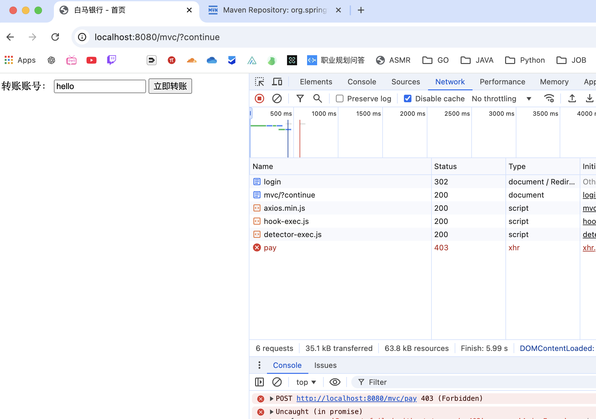

可见登陆逻辑处理好之后，这里的转账系统又出了点问题，403错误。

> 403forbidden，需要前端进行部分处理，添加部分信息给后端即可。

可以关闭CSRF令牌

```java
import org.springframework.context.annotation.Configuration;
import org.springframework.security.config.annotation.web.builders.HttpSecurity;
import org.springframework.security.config.annotation.web.configuration.EnableWebSecurity;
import org.springframework.security.config.annotation.web.configuration.WebSecurityConfigurerAdapter;

@Configuration
@EnableWebSecurity
public class SecurityConfig extends WebSecurityConfigurerAdapter {

    @Override
    protected void configure(HttpSecurity http) throws Exception {
        http
            .authorizeRequests()
                .antMatchers("/mvc/pay").authenticated() // 确保 /mvc/pay 需要认证
                .anyRequest().permitAll()
            .and()
            .formLogin()
            .and()
            .csrf().disable(); // 如果你不想处理 CSRF 令牌，可以禁用 CSRF 保护
    }
}
```

> 修改之前的SecurityConfiguration即可，可以在这里关闭CRFS检验

前端携带令牌处理：带一个不可见部分
```html
<input type="text" th:id="${_csrf.getParameterName()}" th:value="${_csrf.token}" hidden>
```

添加一个不可见的表单给axios处理，修改函数如下：

```html
只是简单的添加一个获取，然后给axios传递即可
```

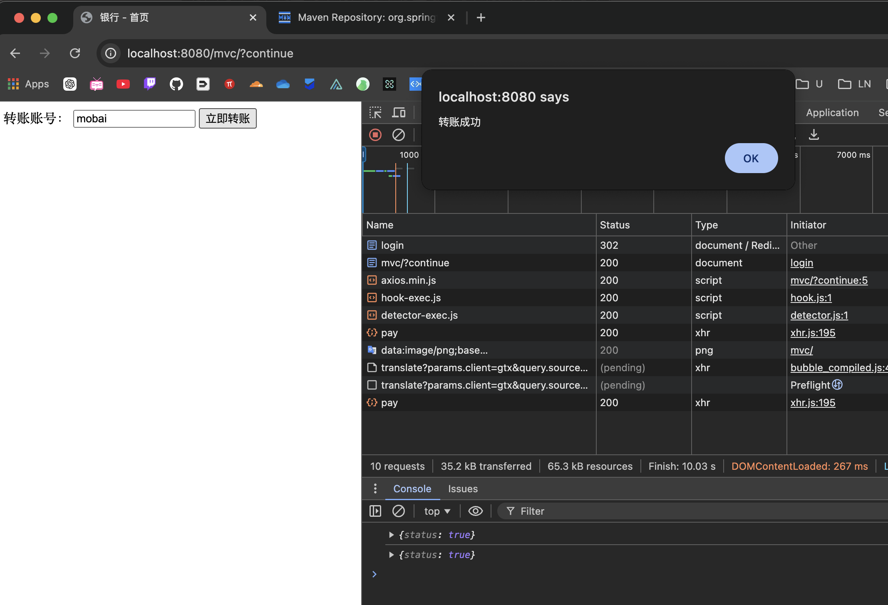

修改成功如上所示。CSRF验证是默认带的验证机制。

## 5.添加加密模块

> 默认的加密模块是有安全隐患的，添加的加密模块如下

修改之前的SecurityConfiguration.java

```java
package com.mobai.config;

import org.springframework.context.annotation.Bean;
import org.springframework.context.annotation.Configuration;
import org.springframework.security.config.annotation.web.configuration.EnableWebSecurity;
import org.springframework.security.core.userdetails.User;
import org.springframework.security.core.userdetails.UserDetails;
import org.springframework.security.core.userdetails.UserDetailsService;
import org.springframework.security.crypto.bcrypt.BCryptPasswordEncoder;
import org.springframework.security.crypto.password.PasswordEncoder;
import org.springframework.security.provisioning.InMemoryUserDetailsManager;

@Configuration
@EnableWebSecurity   //开启WebSecurity相关功能
public class SecurityConfiguration {
  //这里将BCryptPasswordEncoder直接注册为Bean，Security会自动进行选择
  @Bean
  public PasswordEncoder passwordEncoder() {
    return new BCryptPasswordEncoder();
  }

  @Bean
  public UserDetailsService userDetailsService(PasswordEncoder encoder) {
    UserDetails user = User
            .withUsername("user")
            .password(encoder.encode("user"))   //这里将密码进行加密后存储
            .roles("USER")
            .build();
    System.out.println(encoder.encode("user"));  //一会观察一下加密出来之后的密码长啥样
    UserDetails admin = User
            .withUsername("admin")
            .password(encoder.encode("amdin"))   //这里将密码进行加密后存储
            .roles("ADMIN", "USER")
            .build();
    System.out.println(encoder.encode("admin"));  //一会观察一下加密出来之后的密码长啥样
    return new InMemoryUserDetailsManager(user, admin);
  }
}
```

> 注解导入包即可

加密的 密码长这样：

>$2a$10$aJXuq5wc/kB9tGgkKQt24./XU9iK2pMat0BrUYT3kDnSzf4PK5fIC
>$2a$10$8HTWQNOaLkI0nPLIP52Qw.hpy5zU/HJ36ZSJVl.4TuPT/ukC8ukEy

现在就已经不再是明文加密了。

## 6.用数据库信息校验

添加如下依赖：

- mybaits
- mysql-connnector-j
- mybaits-spring
- spring-jdbc

在SecurtiyConfiguraion中添加如下代码：

> 也就是注册数据库相关的Bean，本身是应该直接重新创建一个DatabaseConfiguration的

```java
  // 下面是处理数据库信息
  @Bean
  public DataSource dataSource() {
    //数据源配置
    return new PooledDataSource("com.mysql.cj.jdbc.Driver",
            "jdbc:mysql://localhost:3306/SpringSecurityStudy", "root", "mobaisilent");
  }

  @Bean
  public UserDetailsService userDetailsService(DataSource dataSource,
                                               PasswordEncoder encoder) {
    JdbcUserDetailsManager manager = new JdbcUserDetailsManager(dataSource);
    //仅首次启动时创建一个新的用户用于测试，后续无需创建
    manager.createUser(User.withUsername("mobai")
            .password(encoder.encode("mobai")).roles("USER").build());
    return manager;
  }
  // 当然，即使放到数据库里面的密码也不是明文储存的。
```

数据库模型如下：

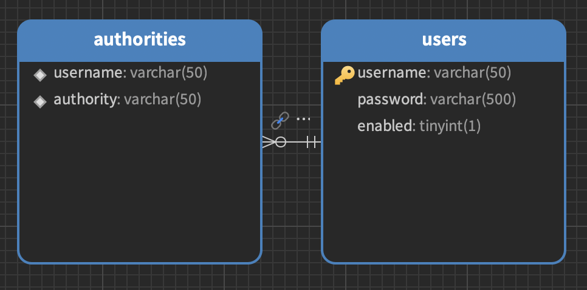

## 7.自建数据库校验

项目架构如下：

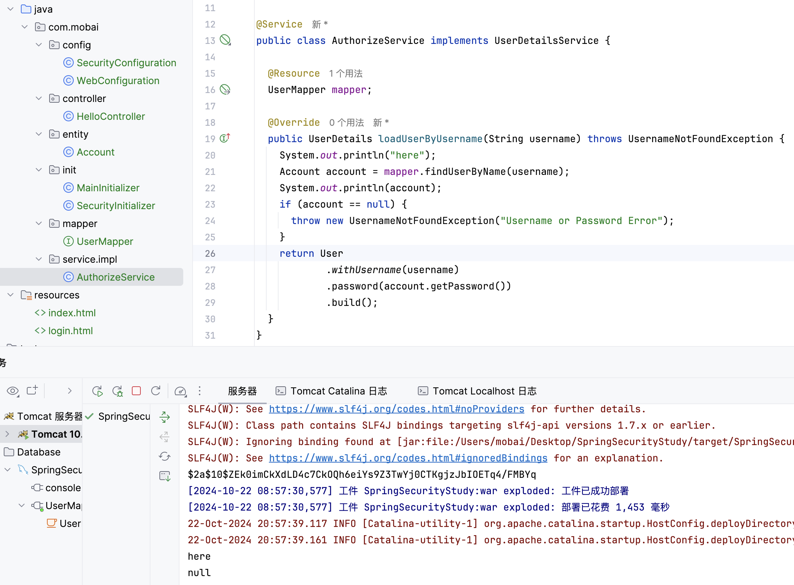

不用多想也能知道大概应该如何添加信息了吧。

> 理清项目结构之后显然没有丁点难度呢。

测试下能否更改密码。

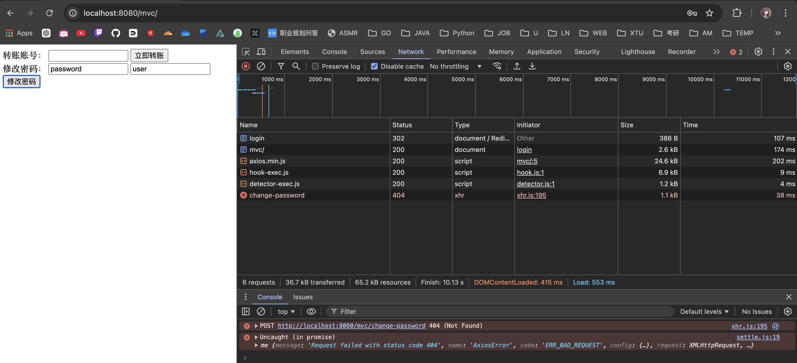

报错了。

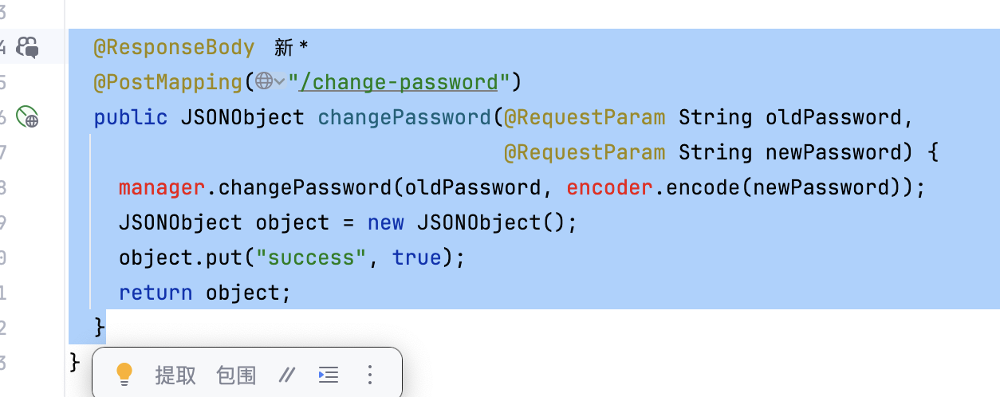

是因为把这里注释掉了，但是如果不注释的话，入屏幕所示，会有两个报错信息。

